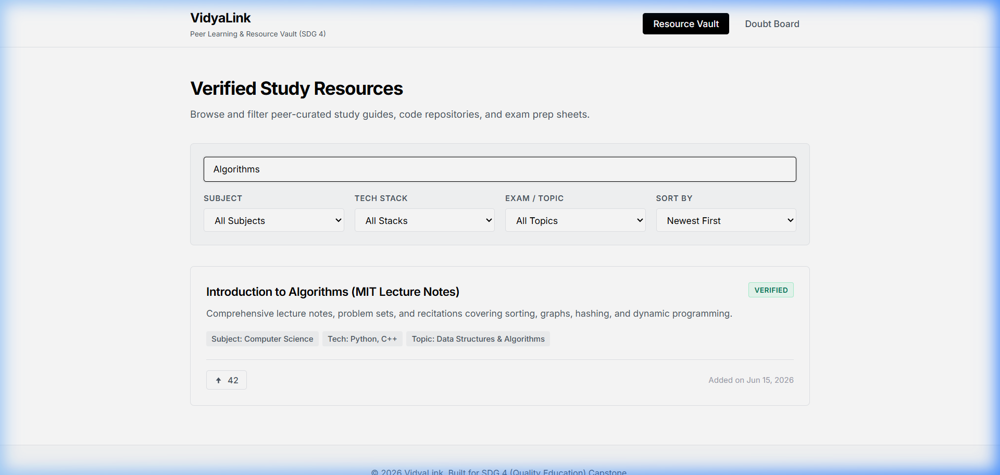
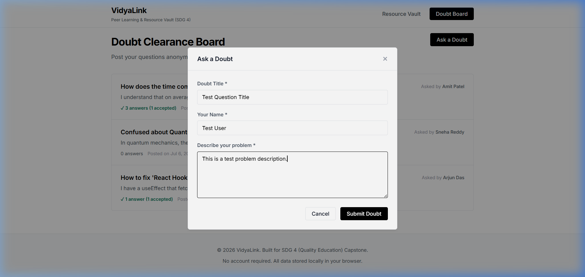
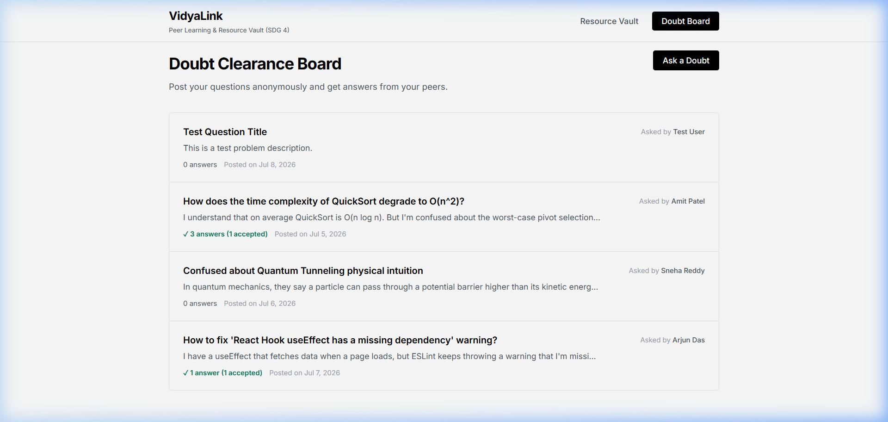

# VidyaLink

**VidyaLink** is a community-driven, open-access peer learning and resource vault web application addressing **SDG 4 (Quality Education)**. It offers a centralized repository for verified academic and technical study resources, combined with a lightweight public Q&A board—completely free, requiring no registrations, accounts, or subscription paywalls.

---

## 📸 Project Showcase & Screenshots

### 1. Resource Vault (Main Page)
Pre-seeded with 15 high-quality academic and developer resources across Computer Science, Mathematics, and Physics.

### 2. Search & Filters
Live text searching and multi-dimensional filtering by Subject, Tech Stack, and Exam Topic.
- **Search filtering (typing "Algorithms"):**
  
- **Subject dropdown filtering (filtering by "Mathematics"):**
  

### 3. Upvoting System
A consensus-based upvote counter that persists in `localStorage` with session-level double-voting protection. Shows sorting by "Top Upvoted" first:

### 4. Doubt Clearance Board
A public discussion section where students post doubts and answers anonymously. Toggling "Accepted Answer" highlights the correct answer in blue and locks it to the top of the answers list.
- **Question detail view & accepted reply highlight:**
  
- **Ask a Doubt form overlay (Modal):**
  
- **New Doubt listed at the top of the doubt board:**
  

---

## 🎯 Sustainable Development Goal 4 Alignment
VidyaLink is built in support of **SDG 4: Quality Education**, which focuses on ensuring inclusive and equitable education and promoting lifelong learning opportunities.
*   **Access Equality**: Eliminates financial barriers by providing premium resources (e.g., GATE study guides, JEE cheat sheets, coding references) completely free.
*   **Open and Frictionless**: By eliminating the requirement of signups and registrations, VidyaLink provides immediate, universal access to study materials.
*   **Peer-to-Peer Help**: The Q&A board promotes collaborative learning, helping students overcome learning blocks through peer mentoring.

---

## 🔍 Problem Statement
Premium study materials, exam revision cheat sheets, and technical guides are frequently locked behind paywalls or scattered across fragmented, unorganized web forums. Students from lower-to-middle-income backgrounds or in self-directed environments face major obstacles in locating reliable resources or getting rapid help when they are stuck. This creates educational inequality and slows learning progress in crucial STEM disciplines.

---

## 🛠️ Technology Stack
This project is built intentionally as a **client-side prototype** to showcase functionality and state management without server costs:
*   **Frontend**: Plain HTML5, Vanilla CSS3, and Vanilla JavaScript (ES6). No frameworks, bundlers, or build steps.
*   **State Persistence**: Browser `localStorage` serves as the primary data store for resources, upvotes, doubts, and replies.
*   **Session Tracking**: Browser `sessionStorage` tracks resource upvotes to prevent double-voting in the same browser session.

---

## 🚀 Key Features
1.  **Resource Vault**: Displays pre-seeded resources with "Verified" badges for curated materials. Supports real-time text query searching and multi-parameter filtering.
2.  **Upvote & Sorting**: Upvoting increments the count, persists in storage, and re-orders items dynamically when the "Sort by: Top" selector is active.
3.  **Doubt Clearance Board**: Q&A section supporting doubt creation, reply submission, and single-solution acceptance (moves the accepted answer to the top with a visual blue border).

---

## 📂 Repository Structure
- [index.html](file:///d:/vaibhav%20gupta/Coding/Projects----Internship/Lenovo%20leap%20internship/Final%20Project-%20VidyaLink/index.html) – Application structure and UI components.
- [style.css](file:///d:/vaibhav%20gupta/Coding/Projects----Internship/Lenovo%20leap%20internship/Final%20Project-%20VidyaLink/style.css) – Premium Minimalist styling and responsive design.
- [app.js](file:///d:/vaibhav%20gupta/Coding/Projects----Internship/Lenovo%20leap%20internship/Final%20Project-%20VidyaLink/app.js) – Core client-side state, seed data, filters, upvotes, and doubt board logic.
- [SUBMISSION.md](file:///d:/vaibhav%20gupta/Coding/Projects----Internship/Lenovo%20leap%20internship/Final%20Project-%20VidyaLink/SUBMISSION.md) – Formatted capstone submission document.
- [SUBMISSION.docx](file:///d:/vaibhav%20gupta/Coding/Projects----Internship/Lenovo%20leap%20internship/Final%20Project-%20VidyaLink/SUBMISSION.docx) – MS Word exported document of the submission.
- [screenshots/](file:///d:/vaibhav%20gupta/Coding/Projects----Internship/Lenovo%20leap%20internship/Final%20Project-%20VidyaLink/screenshots) – Folder containing verification images.

---

## 🔮 Future Scope
*   **Centralized Backend**: Transition to a backend server (e.g., Node.js/Express) and relational database (e.g., PostgreSQL) to sync global state.
*   **User Identity**: Implement authentication (e.g., OAuth/JWT) to track user contributions and manage resource submissions.
*   **Moderation workflows**: Create role-based accounts (teachers, moderators) to verify submitted links.
*   **Mobile Application**: Cross-platform application built using React Native or Flutter.
