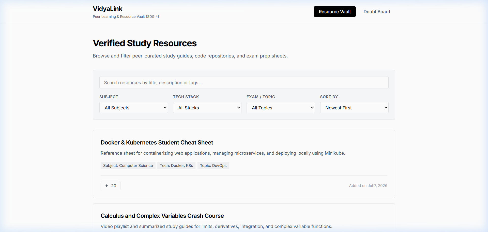
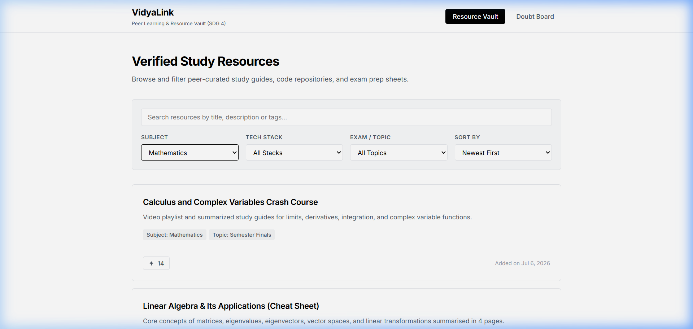
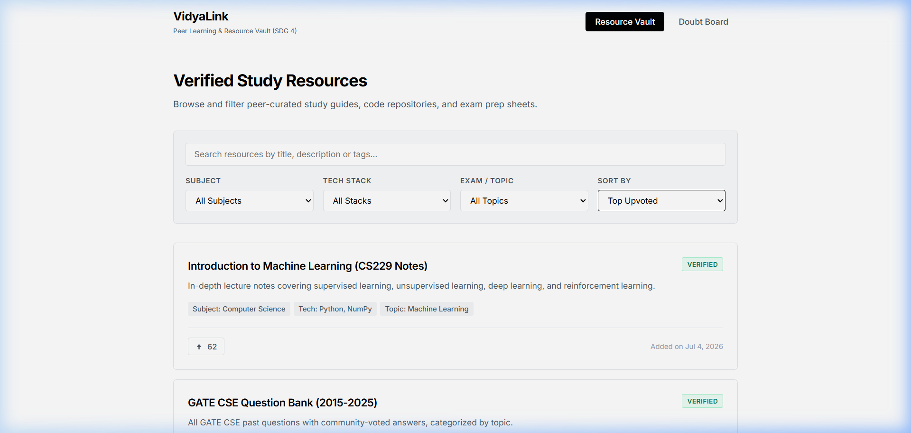
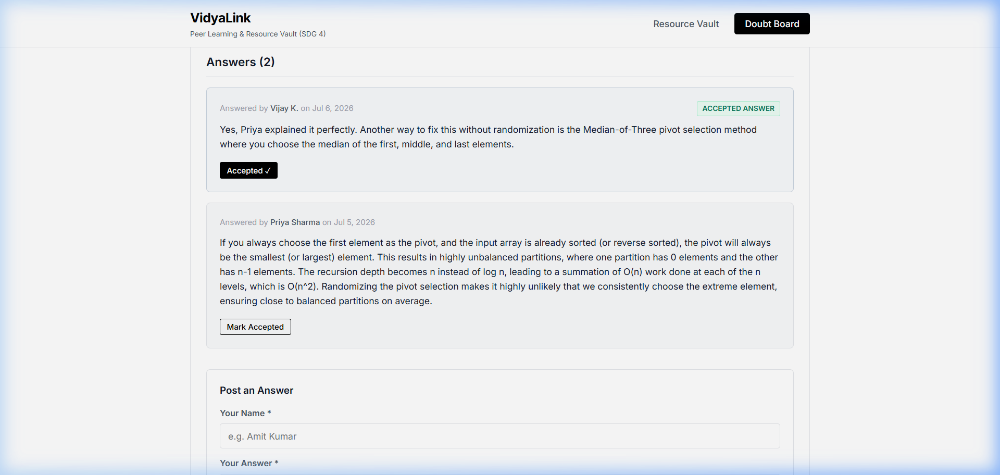

# VidyaLink: Capstone Project Submission

**Project Title**: VidyaLink  
**Focus Area**: SDG 4 (Quality Education)  
**Development Phase**: Client-Side Functional Prototype  

---

## 1. Selected SDG and Reason for Selection
The project addresses **Sustainable Development Goal 4 (SDG 4): Quality Education**. Specifically, SDG 4 aims to "ensure inclusive and equitable quality education and promote lifelong learning opportunities for all." 

The core bottleneck in modern education is not a lack of educational materials, but rather the distribution and accessibility of high-quality, verified materials. While premium textbooks, specialized exam preparation cheat sheets, and structured study guides exist, they are increasingly locked behind subscription paywalls or fragmented across unorganized online discussions. 

By building a free, open-access, community-driven resource vault and doubt-clearance board, VidyaLink aims to reduce educational inequality. Providing students with zero-friction access to study guides and peer assistance directly aligns with the SDG 4 targets of ensuring equal access to affordable, high-quality technical, vocational, and tertiary education.

---

## 2. Problem Statement
Across secondary and higher education institutions, students face a dual challenge:
*   **Information Asymmetry**: Premium study guides, revision materials, coding references, and exam solutions are often locked behind paywalls (subscription services, commercial tutoring sites) or scattered across unorganized, unverified forums.
*   **Support Gap**: When students encounter difficulties while solving academic problems or coding exercises, they lack a dedicated, zero-friction, open platform to seek support from peers.

**Scope of the Problem**: This issue primarily affects students from low-to-middle-income backgrounds who cannot afford subscription-based study portals, as well as students in self-paced learning environments. 

**Severity and Consequences**: Without a centralized, verified, and free repository of educational materials, the academic performance gap between affluent students (with access to premium resources) and underprivileged students widens. If left unresolved, this creates educational stratification, reduces learning outcomes for self-taught developers and public university students, and increases dropout rates in challenging STEM disciplines.

---

## 3. Proposed Solution
**VidyaLink** is a centralized, community-curated peer learning and resource vault web application designed to bridge the educational resource gap. The platform operates on a completely open-access model: there are no registration barriers, no paywalls, and no account requirements.

### How it Works:
*   **Resource Vault**: Students can instantly access a structured repository of academic study sheets, notes, and developer references. Users can filter materials by subject, technology stack, and exam topic, or search via text queries. High-quality items are highlighted with a "Verified" badge.
*   **Upvote System**: A consensus-based upvoting mechanism allows students to upvote helpful resources. The platform can re-sort materials to show top-rated content first, ensuring high-quality resources bubble to the top.
*   **Doubt Clearance Board**: A public, lightweight Q&A board where students can post questions anonymously and reply to peers. To prevent information clutter, the author or community helpers can mark exactly one response as the "Accepted Answer," highlighting it and locking it to the top of the reply list.

### Target Users:
High school students preparing for competitive exams (e.g., JEE), university students preparing for semester finals or competitive technical exams (e.g., GATE), and self-paced programming students looking for coding references.

---

## 4. Project Features
*   **Resource Vault**: A categorized repository pre-seeded with 15 detailed study resources spanning Computer Science, Mathematics, and Physics. Includes live searching and multi-dimensional filtering by Subject, Tech Stack, and Exam Topic, along with a "Verified" badge for official or highly recommended materials.
*   **Upvote System**: Allows users to upvote resources to establish quality hierarchy. The counts persist across page reloads via local storage, and a session-level log prevents double-upvoting. Includes a sorting toggle to organize materials by newest or top upvoted.
*   **Doubt Clearance Board**: A public discussion section where users can post academic or technical questions with an author name and text body. Peers can reply directly to questions. Supports marking exactly one answer as "Accepted," which highlights the solution and moves it to the top of the list for quick reference.

---

## 5. Technology Stack
*   **Frontend**: Plain HTML5 (structure), Vanilla CSS3 (layout and typography), and modern Vanilla JavaScript (client-side application logic).
*   **Backend**: None. This is a client-side prototype designed to run entirely in the user's web browser, ensuring zero server costs and fast performance.
*   **Database / Persistence**: Browser `localStorage` is used to persist the state of resources, upvotes, doubts, and replies. Session state (`sessionStorage`) is used to log user voting history to block double-voting within the same session.

---

## 6. Project Screenshots
Below are screenshots demonstrating the working web application:

*   **Resource Vault Main Page**:
    
*   **Search and Subject Filtering**:
    
*   **Upvote System and Sorting**:
    
*   **Doubt Board Details View with Highlighted Accepted Answer**:
    

---

## 7. Open Source Repository
The complete source code for this project, including historical incremental commits and configurations, is available in the public repository:
[GitHub Repository Link](https://github.com/vaibhv19/Lenovo-leap-Internship)

---

## 8. Future Scope
The current client-side prototype is an intentional architectural stepping stone, serving to demonstrate core user experience flows, state transitions, and utility without incurring server maintenance or database costs. For production deployment, the future scope includes:

1.  **Server and Relational Database**: Transitioning from browser `localStorage` to a centralized backend service (e.g., Node.js/Express) and database (e.g., PostgreSQL) to sync resources and questions across all global users.
2.  **User Authentication and Profiles**: Implementing secure sign-in (e.g., OAuth, email) to track user contributions, allow editing/deleting of posts, and reward active community helpers.
3.  **Moderation and Verification Workflows**: Establishing an admin portal and role-based permissions (e.g., moderators, professors) to review student-submitted resources, verify links, and flag inappropriate content.
4.  **Mobile App Version**: Developing a cross-platform mobile app (e.g., React Native) to enable offline access to saved study notes, mobile notifications for answers, and photo uploads for textbook doubts.
